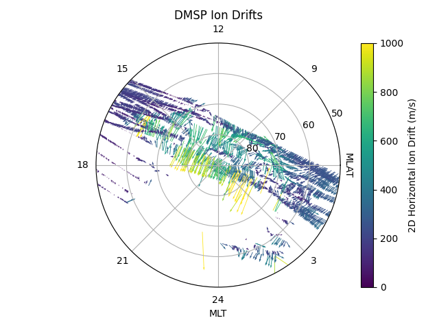

.. _ex-dmsp-methods:

DMSP Ion Drifts at High Latitudes
=================================

Plasma motion measured by the Ion Velocity Meter (IVM) onboard DMSP is natively
presented in spacecraft coordinates and does not include any transformations
of those directions into published coordinate systems. We present an example
on how to plot measured ion drifts at high latitudes using supporting methods
in :py:meth:`pysatMadrigal.instruments.methods.dmsp`.

.. code::

   import datetime as dt
   import matplotlib.pyplot as plt
   import numpy as np
   import numpy.ma as ma

   import pysat
   import pysatMadrigal as pysat_mad

   fdate = dt.datetime(2011, 8, 15)
   ivm = pysat.Instrument('dmsp', 'ivm', tag='utd', inst_id='f15')

   # Smooth ion drifts to only report the most robust of measurements.
   ivm.custom_attach(pysat_mad.instruments.methods.dmsp.smooth_ram_drifts,
                     kwargs={'rpa_flag_key': 'rpa_flag_ut'})

   # Add unit vectors relating presumed satellite orientation along
   # cartesian and polar directions.
   ivm.custom_attach(pysat_mad.instruments.methods.dmsp.add_drift_unit_vectors)

   # Express ion drifts measured in the satellite frame along the added
   # high latitude unit vectors.
   ivm.custom_attach(pysat_mad.instruments.methods.dmsp.add_drifts_polar_cap_x_y,
                     kwargs={'rpa_flag_key': 'rpa_flag_ut'})

   # Download data if not already on system
   if fdate not in ivm.files.files.index:
       ivm.download(fdate)

   # Load data
   ivm.load(date=fdate)

   # Plot multiple orbital passes across polar cap
   f = plt.figure()
   ax = f.add_subplot(111, polar=True)
   ax.set_rlim(0, 40.)
   ax.set_xticks(np.linspace(0, 2. * np.pi - np.pi / 4., 8))
   ax.set_xticklabels(['', 9, 12, 15, 18, 21, 24, 3])
   ax.set_xlabel('MLT')
   ax.set_yticks([10, 20, 30, 40])
   ax.set_yticklabels([80, 70, 60, 50])
   ax.text(np.deg2rad(-5.), 41, 'MLAT', rotation=-90.)
   ax.grid(True)

   # Location of spacecraft in relative polar coords for plotting.
   theta = ivm['mlt'] * (np.pi / 12.) - np.pi / 2.
   r = 90.- np.abs(ivm['mlat'])

   # Calculate magnitude of ion drifts for color values
   mag = np.sqrt(ivm['ion_vel_pc_x']**2 + ivm['ion_vel_pc_y']**2)

   # Make plot of ion drifts
   slice_x = ma.masked_where(np.isnan(ivm['ion_vel_pc_x']), ivm['ion_vel_pc_x'])
   slice_y = ma.masked_where(np.isnan(ivm['ion_vel_pc_y']), ivm['ion_vel_pc_y'])
   vec_plot = ax.quiver(theta, r, slice_x, slice_y, mag, scale=10000,
                        clim=[0, 1000.])

   # Plot drifts without both an RPA and DM measurement in red.
   idx, = np.where(ivm['partial'] == 1)
   ax.quiver(theta[idx], r[idx], slice_x[idx], slice_y[idx], color='r',
             scale=10000)

   # Title, colorbar, and save.
   plt.title('DMSP Ion Drifts')
   plt.colorbar(vec_plot, label='m/s')
   plt.tight_layout()
   plt.show()
   plt.savefig('ex_dmsp_methods.png')

