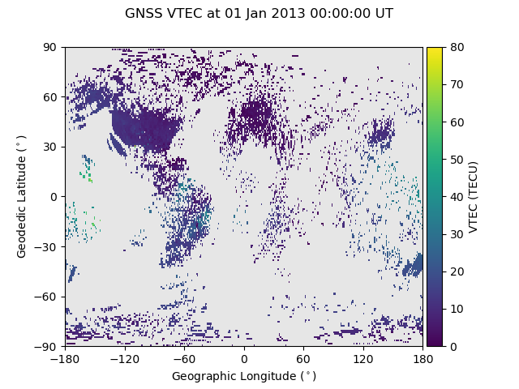

.. _ex-gnss-tec:

Plot GNSS TEC
=============

The Global Navigation Satellte System (GNSS) Total Electron Content (TEC) is one
of the most valuable ionospheric data sets, given its long and continuous
operational duration and expansive coverage.  :py:mod:`pysatMadrigal` currently
only supports Vertical TEC (VTEC) data handling through
:py:mod:`pysatMadrigal.instruments.gnss_tec`.

The VTEC measurements are median filtered to fill 1 degree latitude by 1
degree longitude bins.  This can be represented with spatially representative
coverage as shown in the example below.  Start by obtaining the desired data
and loading it.

.. code::

   import datetime as dt
   import matplotlib as mpl
   import matplotlib.pyplot as plt
   import numpy as np
   import pysat
   import pysatMadrigal as pysat_mad

   vtec = pysat.Instrument(inst_module=pysat_mad.instruments.gnss_tec,
                           tag='vtec')
   ftime = dt.datetime(2013, 1, 1)

   if not ftime in vtec.files.files.index:
       vtec.download(start=ftime, user='firstname+lastname', password='myname@email.address')

   vtec.load(date=ftime)
   print(vtec.variables)

The result of the above command should be
``['time', 'gdlat', 'glon', 'dtec', 'gdalt', 'tec']``, where ``'tec'`` is the
VTEC and ``'dtec'`` is the error in the VTEC.  To plot the data on a grid where
each value takes up the desired grid size, we need to extend the latitude and
longitude coordinates, as the data is specified at the lower edge of each
coordinate bin.

.. code::

   coords = {}
   for ckey in ['gdlat', 'glon']:
       coords[ckey] = list(vtec[ckey].values)
       coords[ckey].append(vtec.meta[ckey, vtec.meta.labels.max_val])
       coords[ckey] = np.array(coords[ckey])

Now, create a figure using `pcolormesh <https://matplotlib.org/stable/api/_as_gen/matplotlib.pyplot.pcolormesh.html#matplotlib.pyplot.pcolormesh>`_ to create
a regular grid with VTEC value indicated by color.

.. code::

   fig = plt.figure()
   ax = fig.add_subplot(111)

   itime = 0
   vmin = vtec.meta['tec', vtec.meta.labels.min_val]
   vmax = np.ceil(vtec['tec'][itime].max().values / 10.0) * 10.0
   con = ax.pcolormesh(coords['glon'], coords['gdlat'],
                       vtec['tec'].values[itime], vmin=vmin, vmax=vmax)

   ax.set_facecolor('0.9')
   ax.xaxis.set_major_locator(mpl.ticker.MultipleLocator(60))
   ax.yaxis.set_major_locator(mpl.ticker.MultipleLocator(30))
   ax.set_xlabel('Geographic Longitude ($^\circ$)')
   ax.set_ylabel('Geodedic Latitude ($^\circ$)')
   plt.colorbar(mappable=con, ax=ax, location='right', fraction=.1, pad=.01,
                label='VTEC ({:s})'.format(vtec.meta['tec',
		                                     vtec.meta.labels.units]))
   fig.suptitle('{:s} {:s} at {:s}'.format(
       vtec.platform.upper(), vtec.tag.upper(),
       vtec.index[itime].strftime('%d %b %Y %H:%M:%S UT'), fontsize='medium'))

   plt.show()

