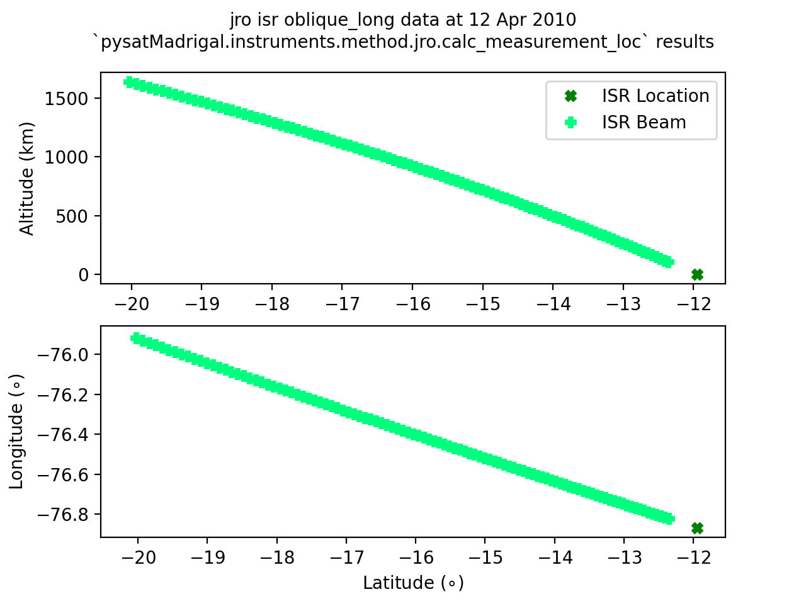

.. _ex-jro-beam-loc:

Calculate JRO ISR Beam Location
===============================

For measurements made using a single beam, it may be more appropriate to account
for the changes in beam direction with altitude when determining the measurement
location instead of using the location of the radar.  The method
:py:meth:`instruments.methods.jro.calc_measurement_loc` (see :ref:`meth-jro`)
uses the beam azimuth and elevation measurements to determine the geodetic
latitude and longitude.

This method is designed to be used with the JRO ISR data, and so assumes the
azimuths and elevations have data variable names with the format ``'eldir#'``
and ``'azdir#'`` (where **#** is the beam number), or ``'elm'`` and ``'azm'``.
It will modify the :py:attr:`pysat.Instrument.data` object by adding latitude
(``'gdlat#'``) and longitude (``'gdlon#'``) variables for every beam that has
appropriately labeled azimuth and elevatiton data.  If the azimuth and elevation
angle variables don't specify the beam number, **#** will be set to ``'_bm'``.

The easiest way to use :py:meth:`instruments.methods.jro.calc_measurement_loc`
is to attach it to the JRO ISR :py:class:`pysat.Instrument` as a `custom
function <https://pysat.readthedocs.io/en/latest/tutorial/tutorial_custom.html>`_
before loading data.

.. code::

   import datetime as dt
   import pysat
   import pysatMadrigal as pysat_mad

   jro_obl = pysat.Instrument(inst_module=pysat_mad.instruments.jro_isr,
                              tag='oblique_long')
   jro_obl.custom_attach(pysat_mad.instruments.methods.jro.calc_measurement_loc)

If necessary, download the desired data before loading it.  The geographic
beam locations will be present alongside the azimuths and elevations.

.. code::

   ftime = dt.datetime(2010, 4, 12)

   if not ftime in jro_obl.files.files.index:
       jro_obl.download(start=ftime)

   jro_obl.load(date=ftime)
   'gdlat_bm' in jro_obl.variables and 'gdlon_bm' in jro_obl.variables

The result of the above command should be ``True``.  To better visualize the
beam location calculation, let us plot the locations of the beam range gates
and the radar location.

.. code::

   import matplotlib.pyplot as plt

   # Initialize the figure and axes
   fig = plt.figure()
   ax_alt = fig.add_subplot(211)
   ax_geo = fig.add_subplot(212)

   # Plot the altitude data
   ax_alt.plot(jro_obl['gdlatr'], 0.52, 'X', color='green')
   ax_alt.plot(jro_obl['gdlat_bm'], jro_obl['gdalt'], 'P', color='springgreen')

   # Plot the lat/lon data
   ax_geo.plot(jro_obl['gdlatr'], jro_obl['gdlonr'], 'X', color='green')
   ax_geo.plot(jro_obl['gdlat_bm'], jro_obl['gdlon_bm'], 'P',
               color='springgreen')

   # Format the figure
   ax_geo.set_xlabel('Latitude ($\circ$)')
   ax_geo.set_ylabel('Longitude ($\circ$)')
   ax_alt.set_ylabel('Altitude (km)')
   ax_alt.legend(['ISR Location', 'ISR Beam'], fontsize='medium')
   fig.suptitle('{:s} {:s} {:s} data at {:s}\n`pysatMadrigal.instruments.method.jro.calc_measurement_loc` results'.format(
       jro_obl.platform, jro_obl.name, jro_obl.tag,
       jro_obl.index[0].strftime('%d %b %Y')), fontsize='medium')

