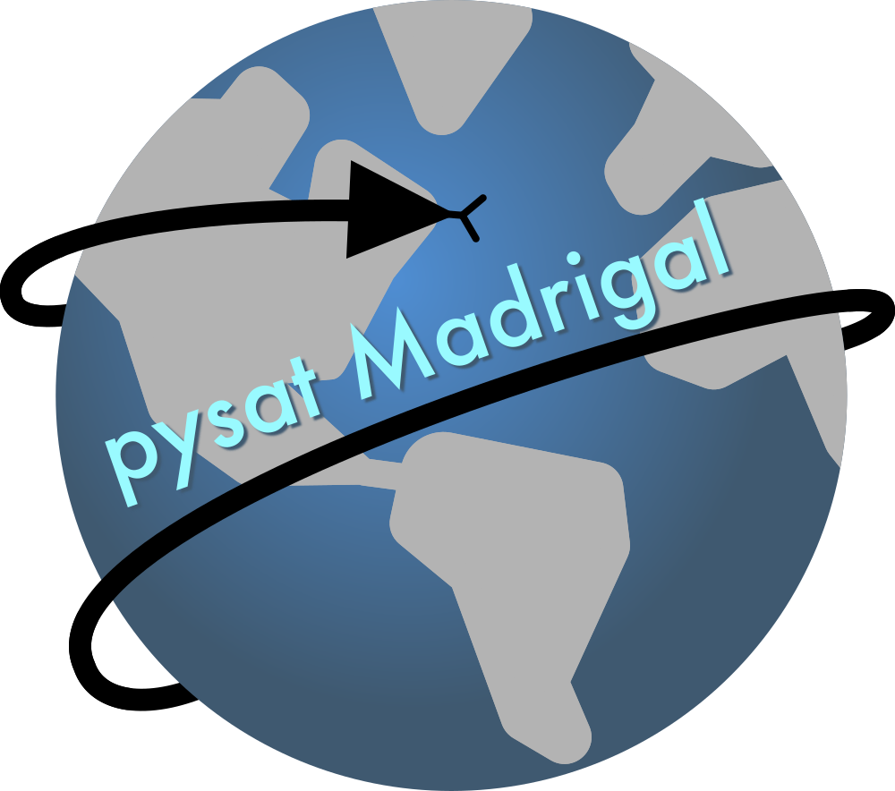

Overview
========

The `CEDAR Madrigal database <http://cedar.openmadrigal.org/>`_ houses several
ground- and space-based data sets for instruments that provide upper
atmospheric, scientific observations.

